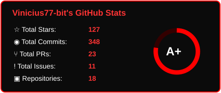
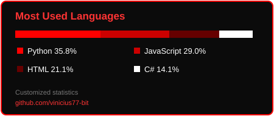

  

## Olá! Eu sou o Vinicius Adolfo Silveira

- Sobre mim
- 🔭 Atualmente estudando
- 🌱 Moro no Brasil
- ⚡interesse em analise e desenvolvimento de sistemas

  

  
  

<code></code>
<code></code>
<code></code>
<code></code>

